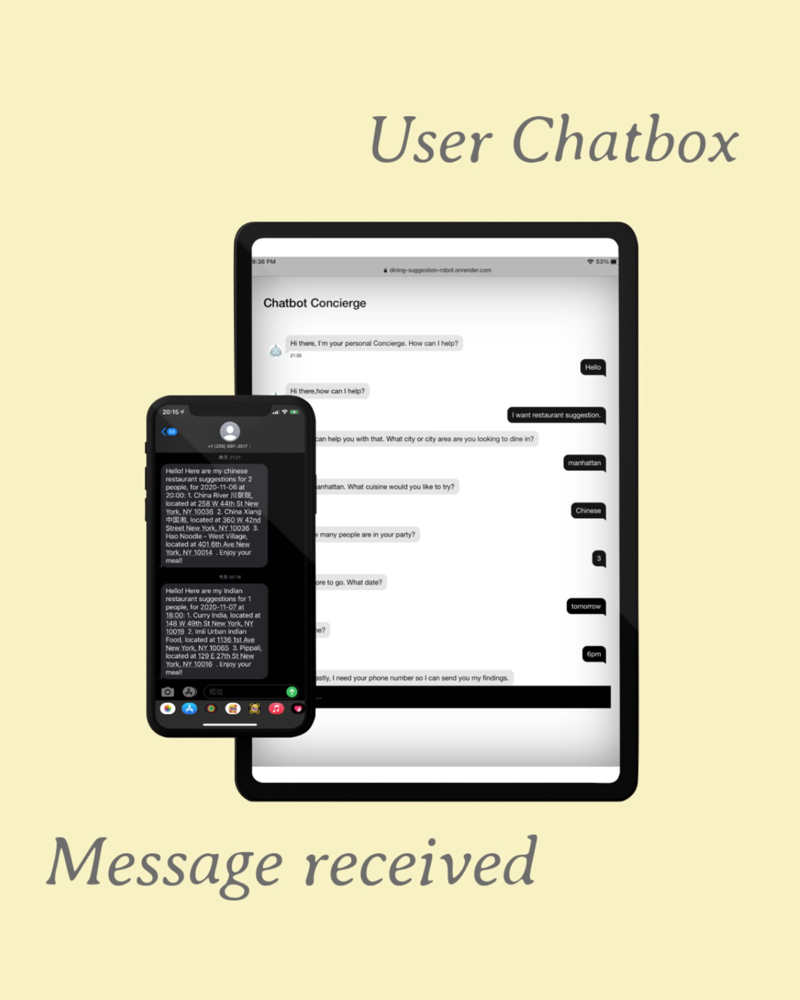
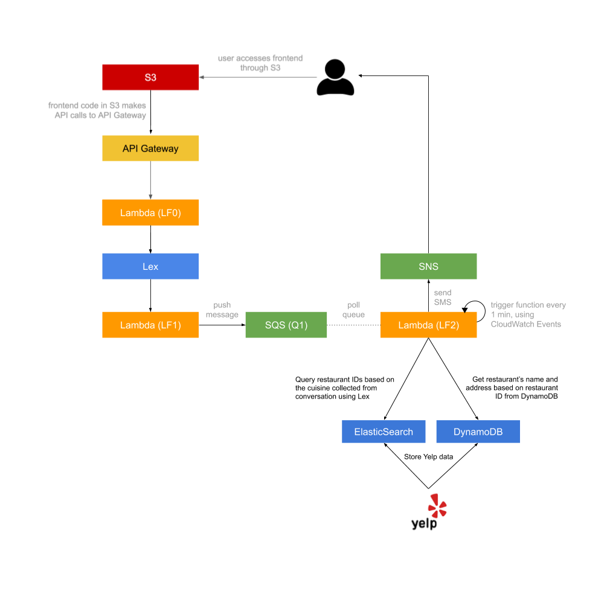

# Dining Suggestion Robot

In this project, we build a dining suggestion robot using Amazon Web Service (AWS). The user can chat with our robot on   the website. The robot will ask user some questions, such as "which cuisine do you prefer?". Then the robot can give relative suggestions about restaurants, and send the suggestion results to user's phone by SMS. 

---

[**Important**: In order to avoid unnecessary charges by AWS, related services have been deleted, but you can always rebuild the whole project by using code files in this repository.]

---

### Architecture Diagram

The whole architecture diagram is shown as above. 

We host our website file (including HTML, CSS, JavaScript files) on S3 bucket. When users chat with robot on the website, the website sends request to API Gateway, and then pass to Lambda Function (LF0). LF0 handles the user input messages to Lex, receive message from Lex and send back to user. Lex sends user message to another Lambda Function (LF1) to do some logistics, verify the message format and guide user to answer all the pre-set questions. After getting all the necessary information, LF1 push messages to SQS (Q1) to store information temporarily. 

Our data for restaurant information comes from Yelp. We use Yelp API to store the restaurant information in DynamoDB and ElasticSearch. Lambda Function (LF2) is triggered by CloudWatch every minute. When it is triggered, LF2 poll the message from SQS (Q1) and search the relevant restaurants in our Database (ElasticSearch and DynamoDB). Then LF2 integrate all the information and send SMS to user's phone by SNS. Finally, the user will receive the suggestion message.

### Project Rebuild

You can find all the necessary source code [here](https://github.com/jerry6066/dining-suggestion-robot/tree/main/aws%20file) and follow the instruction step by step.

